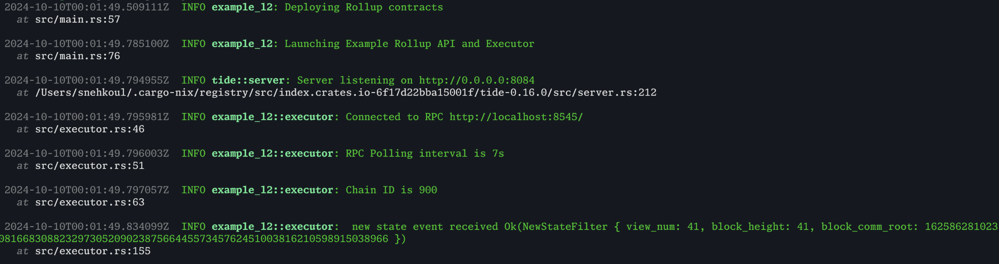
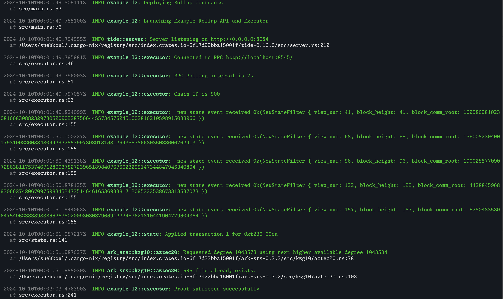
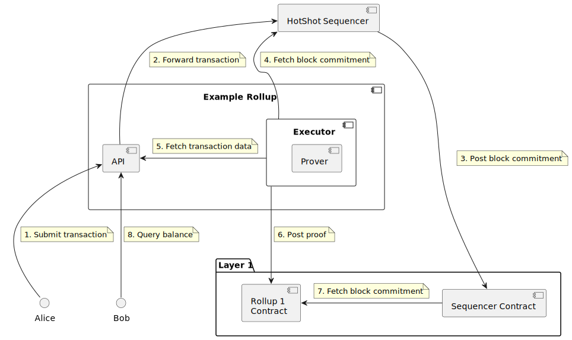

# Example Rollup Documentation

This repository contains an example rollup that integrates with the Espresso Network. The example rollup represents a
simple key/value account store that receives ordered transactions from Espresso, executes them in the rollup VM, and
publishes mock state proofs to an L1 (Ethereum) smart contract. The rollup contains a simple API for submitting
transactions and querying account balances.

## Introduction

Espresso is built upon
[HotShot](https://github.com/EspressoSystems/HotShot), a network that achieves consensus on batches of rollup transactions.
At a high level, a rollup is an L1 scaling solution that performs expensive computations off chain. In the case of
zkRollups, a prover periodically submits rollup state checkpoints along with batch proofs of transaction validity to the
L1. The example illustrated here is a mock zkRollup. To learn more about the Espresso
rollups, read our [docs](https://docs.espressosys.com/network)

## Running the Example

### Prerequisites

Ensure `docker` is installed on your system.

For linux distributions follow official instructions of your linux distribution or see
[the official docker instructions](https://docs.docker.com/engine/install/).

### Running the Example Rollup on the Espresso Network

We first need to start a local Espresso Network.

    git clone https://github.com/EspressoSystems/espresso-network
    cd espresso-network
    docker compose pull
    docker compose up -d --wait

Once that is finished deploy the example rollup, it can be run natively.

To run natively a rust toolchain is required. We provide a nix shell to install
all dependencies. Nix can be installed via the
[nix-installer](https://github.com/DeterminateSystems/nix-installer). Once
installed run the following from the root of the project:

    nix develop
    just dev-demo

### Interacting with the Demo

After running `just dev-demo`, you will be able to see `new state event` logs after a few minutes.



Query the genesis account balance, the initial balance should be 9999

```
curl http://localhost:8084/v0/rollup/balance/0xf23694f9c6d4837fc596c4eb7c3c3d8a8bae69ca
```

Send some tokens to `0x885ee92eebda03540066a25a57cc625bbee15d5a` using:

```
curl -X POST -H "Content-Type: application/json" http://0.0.0.0:8084/v0/rollup/submit -d "{\"transaction\":{\"amount\":100,\"destination\":\"0x885ee92eebda03540066a25a57cc625bbee15d5a\",\"nonce\":1},\"signature\":{\"r\":\"0x61395b25cf41321bc1242ec301c0aa5a5e5ff47b697f80119a20ce3e5be66f9e\",\"s\":\"0x447cf03a5ddb28b9a189d108a8e91efa523fd3fb37cebab1cad610d82a8edbb0\",\"v\":27}}"
```

After you have sent the transaction, wait for the `Applied Transaction` and `Proof submitted` log before querying the updated balance.



Query the updated balance:

```
curl http://localhost:8084/v0/rollup/balance/0xf23694f9c6d4837fc596c4eb7c3c3d8a8bae69ca
```

## Transaction Lifecycle

The diagram below represents the lifecycle of a single rollup transaction, illustrating how the example rollup interacts
with the Espresso network along the way. The diagram below is a simplified version of this
[system overview](https://docs.espressosys.com/network/learn/the-espresso-network/system-overview), focusing on a
single example rollup transaction.



1. Alice signs a transaction transferring rollup tokens to Bob. Alice sends this transaction to the Rollup through the
   `submit` endpoint of the rollup API. If Alice is concerned about censorship, she can send her transaction directly to
   the network.
2. The rollup API server forwards the transaction to the network. The transaction is tagged with the rollup’s unique
   Namespace ID so that the rollup can identify its own transactions in step 4.
3. The Espresso network processes the transaction, eventually including it in a block. An Espresso node submits the
   new state to the `Light Client` contract on L1, which verifies that consensus has been reached on the new state.
4. The executor service receives notification of the new state via a subscription to a query service provided
   by an Espresso node.
5. The executor also listens for the headers of the new block that was sequenced on the Espresso Network. It then fetches the
   namespace proof, vid common and block hash.
6. The executor then processes the
   transactions, performing the following steps:
   - The executor applies transactions to the VM state. Before application, each transaction is validated, and invalid
     transactions are discarded (a real rollup would eventually include proofs of transaction invalidity). In our case,
     the block contains a single transaction from Alice to Bob. Since the transaction contains a valid signature and
     Alice has sufficient balance, the transaction is successfully applied and balances are updated.
   - After transaction application, the executor updates the VM state with the new block commitment and previous state
     commitment.
   - The executor computes a new state commitment, and generates a mock proof that the state was updated correctly with
     respect to the HotShot block commitment.
7. The executor posts the proof to the rollup contract.
8. The rollup contract verifies the proof by querying the latest certified block commitment from the Light Client contract.
   Note: In our current implementation, we aren't doing much verification in the contract. For production purposes, the rollup contract
   will need to do additional verifications with the light client state.
9. Bob queries his balance using the rollup API, and sees that he has received some new tokens. If this were a real
   rollup, a potentially distrustful Bob could verify his balance against the rollup contract state commitment (the
   example does not currently include this feature).

## Rollup Architecture

**Rollup State**

The state of the example rollup consists of:

- **Accounts**: A mapping of ECDSA (EVM-style) addresses to balances of a dummy token.
- **Block Hash**: Hash of the most recent hotshot consensus block.
- **Previous state commitment**: A cryptographic commitment to the state of the rollup prior to the most recent
  execution step.
- **VM**: Information about the Rollup VM. Right now, this is a simple ID.

**Executor**

The executor is a service responsible for subscribing to new state posted to the L1 light client contract, applying
transactions to the rollup state, and submitting mock proofs to the rollup
contract. Rollups often separate the roles of executor and prover into two distinct services, but this example combines
them for the sake of simplicity.

**Rollup API**

The rollup API is a REST API that includes a `submit` and `query` endpoint.

**Rollup Contract**

The rollup contract stores the most recent rollup state commitment. The contract updates the state commitment when it
receives a valid state transition proof from the executor.

## Espresso

In this example, we used a few Espresso components as described below. More information can be found
in the [docs](https://docs.espressosys.com/network)

### Light Client

The light client is a smart contract that verifies the integrity of the rollup state. The contract
code can be found
[here](https://github.com/EspressoSystems/espresso-network/blob/main/contracts/src/LightClient.sol)

### Espresso Network

We ran an espresso network using the espresso-network docker images. The network uses hotshot to
achieve consensus on the rollup state. Architecture can be found
[here](https://github.com/EspressoSystems/espresso-network/tree/main?tab=readme-ov-file#architecture)

### Hotshot

Espresso Network uses [HotShot](https://github.com/EspressoSystems/HotShot) to achieve consensus on the rollup state.
